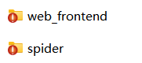
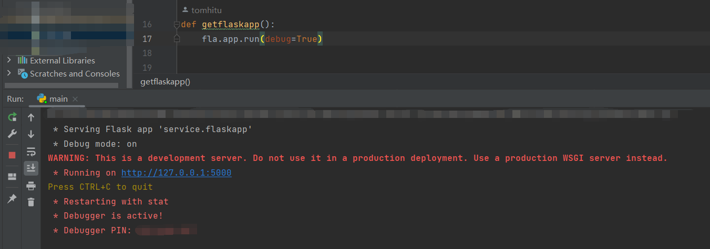
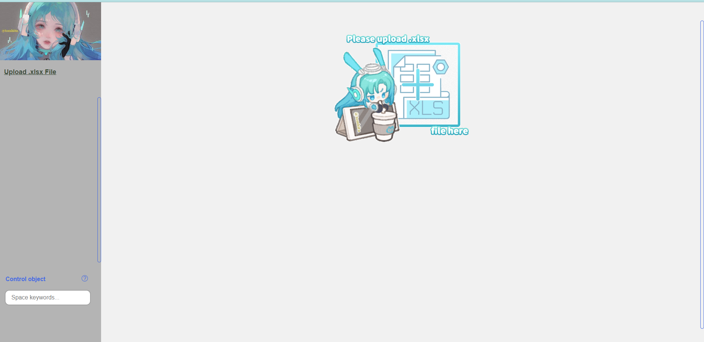
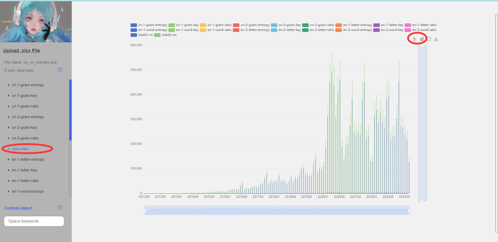
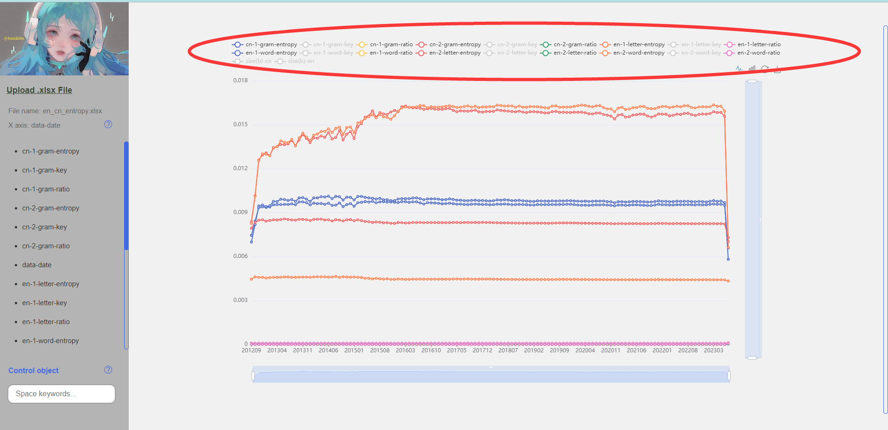
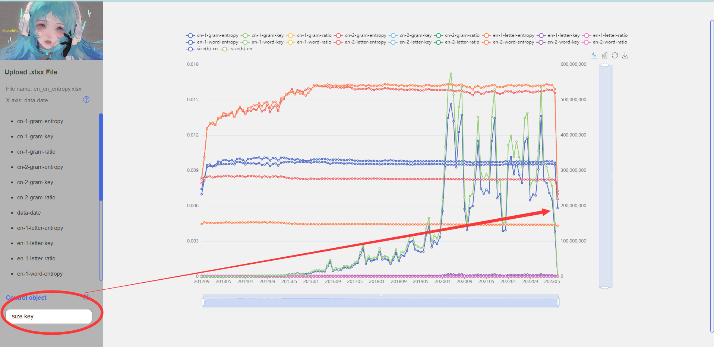
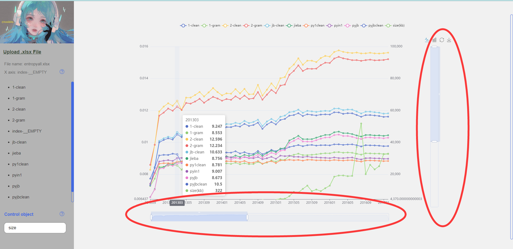
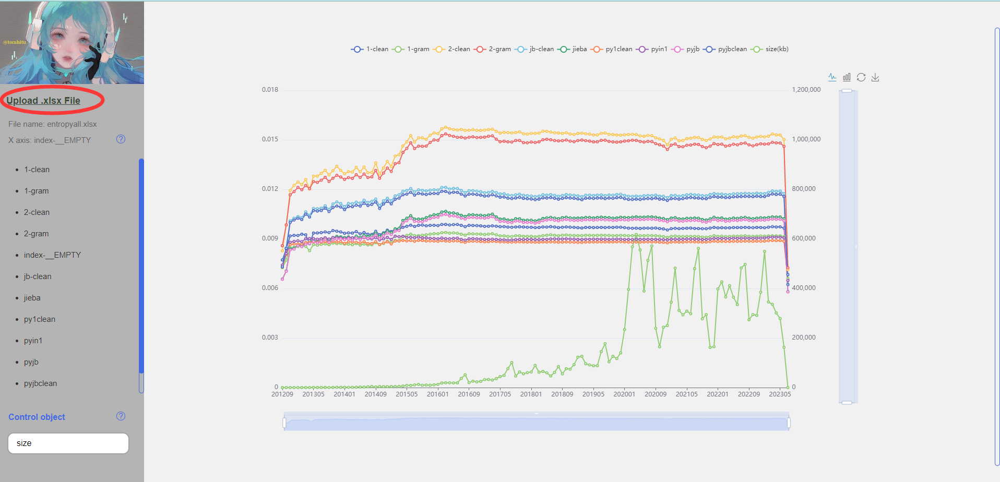

# Welcom to use xlsx2chart project

## User Manual

### Prerequisites
:inbox_tray: Download the project.  

#### Front end
:zap: Download the project from github.  
:star: https://github.com/tomhitu/xlsx2chart  

:zap: Download the project from git.  
:star: https://github.com/tomhitu/xlsx2chart.git  

#### Back end
:zap: Download the project from github.  
:star: https://github.com/tomhitu/irp-entropy  

:zap: Download the project from git.  
:star: https://github.com/tomhitu/irp-entropy.git  

### Operation

#### Initialisation
:balloon: Compile the back-end port. (Please see in irp-entropy tt.getflaskapp())  

:balloon: Run index.html.  

#### Function
:open_file_folder: Upload the xlsx file.  

:chart_with_upwards_trend: Click the left column to update X-axis and right-top to choose chart type.  

:bar_chart: Click on the marker above the image to control the data display.  

:bar_chart: Write the marker into the left bottom to be the control data.  

:cake: Control slider to zoom in and out of details.  

:four_leaf_clover: Click the Upload .xlsx File to update the data.  

