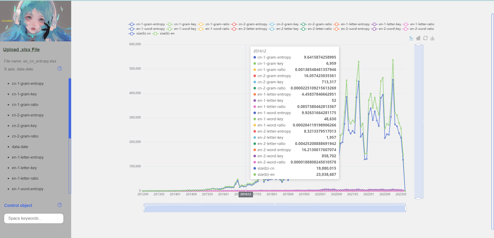

# Welcom to use xlsx2chart project

## Update 2023/11/11
### Toolbox for Chart

Considering the inconvenience of zooming in and out after the image is downloaded to the actual display, added toolbox menu: adjust font size, hide zoom bar.

## Updated 2023/09/17
### Front-End Optimization and Backend Code Preservation

In the latest version of this application, I've made significant optimizations to our workflow. All operations can now be performed on the frontend, eliminating the need to run a Python environment. This change enhances user-friendliness and improves performance.  

#### Backend Code Still Available
Despite these updates, we've opted to keep the original backend Python code. You can find this code in the py(beta) folder, where it remains valuable for optimization reference.  

#### File Format Support
Currently, the application supports only .xlsx Excel files.  

#### Custom Configuration
If you need to adjust the way Excel content is read, you can modify the readExcelContent function located in the clickcolumn.js file to meet your specific requirements.  

## User Manual

### Prerequisites
:inbox_tray: Download the project.  
#### Front end
:zap: Download the project from github.  
:star: https://github.com/tomhitu/xlsx2chart  

:zap: Download the project from git.  
:star: https://github.com/tomhitu/xlsx2chart.git  

### Operation

#### Initialisation

:balloon: Run index.html.  

#### Function
:open_file_folder: Upload the xlsx file.  

:chart_with_upwards_trend: Click the left column to update X-axis and right-top to choose chart type.  

:bar_chart: Click on the marker above the image to control the data display.  

:bar_chart: Write the marker into the left bottom to be the control data.  

:cake: Control slider to zoom in and out of details.  

:four_leaf_clover: Click the Upload .xlsx File to update the data.  

